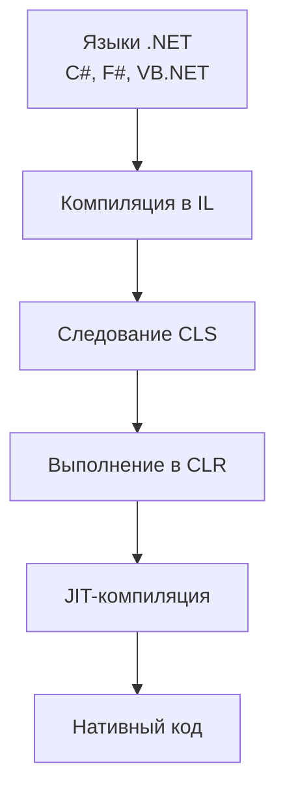
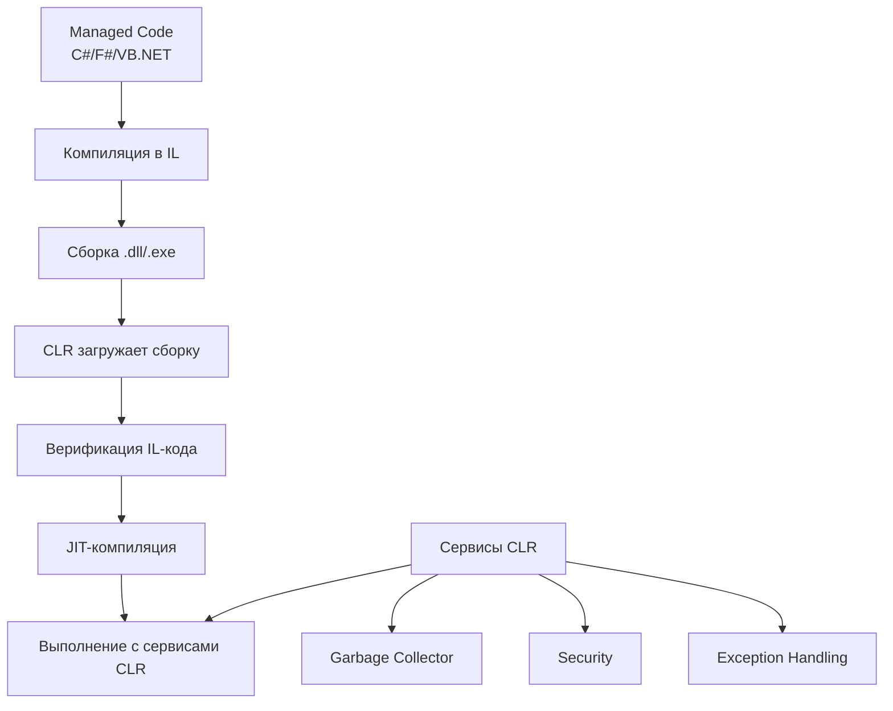

# Общие вопросы

## Что такое сборка?
<details>
<summary>Развернуть ответ</summary>
Сборка (Assembly) — это минимальная единица развертывания и версионирования в .NET. 
По сути, это скомпилированный код, упакованный в виде файла с расширением .exe (исполняемое приложение) или .dll (библиотека).
Однако, это лишь верхушка айсберга. Глубже, сборка — это логическая единица, содержащая четыре критически важных компонента:

### Компоненты сборки

| Компонент | Описание |
|-----------|----------|
| **MSIL-код (CIL)** | Скомпилированный код приложения на промежуточном языке (Intermediate Language). Исходный код C# компилируется не в машинные инструкции, а в этот универсальный язык, который потом JIT-компилятор (Just-In-Time) превращает в машинный код во время выполнения. |
| **Метаданные** | Информация о типах, определенных в сборке: их именах, видимости, базовых классах, интерфейсах, методах, свойствах, полях и т.д. Именно благодаря метаданным работает механизм рефлексии (Reflection). |
| **Манифест сборки** | "Содержание" или "паспорт" сборки, содержащий метаинформацию о самой сборке (см. таблицу ниже). |
| **Ресурсы** | Дополнительные файлы, такие как изображения, строки локализации, значки и т.д., которые добавляются в сборку или поставляются вместе с ней. |

### Содержимое манифеста сборки

| Элемент манифеста | Описание |
|-------------------|----------|
| **Идентификатор сборки** | Имя, версия, культура (например, для локализации) и строгое имя (Strong Name, если оно используется). |
| **Список файлов** | Все файлы, входящие в сборку (если она многофайловая). |
| **Список зависимостей** | Ссылки на все другие сборки, от которых зависит текущая. |
| **Набор разрешений** | Разрешения, которые требуются сборке для работы (это часть модели безопасности CAS — Code Access Security). |

#### Ключевые аспекты:

А. Физическое представление: Однофайловые и многофайловые сборки
* Однофайловая сборка: Самый распространенный случай. Один .dll или .exe файл, содержащий в себе весь MSIL, метаданные, манифест и ресурсы.
* Многофайловая сборка: Редкость на практике, но важна для понимания архитектуры.
Состоит из нескольких модулей (файлы .netmodule) и одного главного файла с манифестом.
Манифест в главном файле ссылается на все остальные модули.
Это могло быть полезно для оптимизации загрузки (загружать только нужные модули) или для комбинирования кода на разных языках .NET.

Б. Управление версиями и Side-by-Side Execution
Манифест сборки — основа для управления версиями в .NET. Среда выполнения строго следит за версиями сборок, на которые ссылается приложение. 
Это позволяет реализовать параллельное выполнение (Side-by-Side Execution): на одном компьютере могут одновременно существовать и работать несколько версий одной и той же сборки. 
Это решает знаменитую "проблему DLL Hell", которая была бичом классического Win32.

В. Глобальный кэш сборок (GAC — Global Assembly Cache)
GAC — это специальное хранилище в файловой системе Windows для сборок со строгими именами (Strong-Named Assemblies), которые должны быть разделены между многими приложениями.
Размещение сборки в GAC позволяет:
* Разделять одну сборку между несколькими приложениями.
* Управлять версиями на уровне машины.
* Повышать доверие к сборке (так как она прошла определенные этапы установки).

Г. Контексты загрузки сборок
Senior-разработчик должен понимать, как CLR находит и загружает сборки. Есть несколько контекстов:
* Контекст загрузки по умолчанию (Load Context): Сюда загружаются сборки, найденные путем probing (поиска в папке приложения и подпапках) или явно загруженные из GAC.
* Контекст загрузки из неидентичного пути (LoadFrom Context): Сборки, загруженные по полному пути с помощью метода Assembly.LoadFrom().
* Контекст только для рефлексии (Reflection-Only Context): Сборки, загруженные только для чтения метаданных (например, с помощью Assembly.ReflectionOnlyLoad), без возможности выполнения кода.

Понимание этих контекстов критически важно для решения проблем, связанных с разрешением зависимостей, например, знаменитой ошибки "Could not load file or assembly ... or one of its dependencies".

Д. Приватные и общие сборки
* Приватные сборки: Располагаются в папке приложения (или ее подпапках) и используются только этим приложением. Это стандартный и рекомендуемый подход для развертывания (Deployment mode "xcopy").
* Общие сборки: Размещаются в GAC и доступны для всех приложений на машине. Обычно это системные библиотеки или библиотеки компаний широкого профиля.

</details>

## Что такое EXE и DLL?
<details>
<summary>Развернуть ответ</summary>

Классическое (Win32) представление:
* EXE (Executable): Исполняемый файл. Это программа, которую можно запустить напрямую. Он содержит точку входа (main в C/C++, Main в C#), с которой начинается выполнение.
* DLL (Dynamic Link Library): Библиотека динамической компоновки. Это библиотека кода, которая не может быть запущена самостоятельно.
Она содержит функции, классы и ресурсы, которые могут быть использованы другими EXE или DLL.

В контексте .NET: Здесь начинается самое интересное. И EXE, и DLL являются сборками (Assemblies). Это ключевой момент.
Они оба следуют одному и тому же формату Portable Executable (PE) и содержат MSIL-код, метаданные, манифест и ресурсы.

Так в чем же тогда разница? Давайте разберем по пунктам.

Сравнительная таблица: EXE vs DLL в .NET

| Критерий              | EXE-сборка                                                                                                  | DLL-сборка                                                                      |
|-----------------------|-------------------------------------------------------------------------------------------------------------|---------------------------------------------------------------------------------|
| Основное назначение   | Запуск как автономное приложение.                                                                           | Использование в качестве библиотеки компонентов.                                |
| Точка входа           | Обязательно имеет метод Main() как точку входа приложения.                                                  | Не имеет точки входа. Не может быть запущена напрямую.                          |
| Потоки исполнения     | Создает свой собственный процесс (Process) при запуске. Каждый EXE работает в своем изолированном процессе. | Загружается в процесс хост-приложения (например, в процесс вашего EXE или IIS). |
| Пространство имен     | Часто определяет логику верхнего уровня, компоновку модулей.                                                | Служит контейнером для многократно используемых типов, сервисов, моделей.       |
| Потребление           | Потребляет (ссылается на) другие DLL.                                                                       | Потребляется EXE или другими DLL.                                               |
| Примеры               | Консольное приложение, WPF/WinForms приложение, исполняемый файл сервиса.                                   | Библиотека классов, ASP.NET Core MVC-библиотека, NuGet-пакет.                   |

1. Процессы и АппДомены (AppDomains)

Это критически важное различие, особенно для Senior-разработчика.

* EXE при запуске создает новый процесс в операционной системе. 
Процесс — это изолированная единица выполнения со своим собственным виртуальным адресным пространством.
* DLL всегда загружается в память уже существующего процесса. 
В рамках .NET Framework существовало дополнительное понятие AppDomain — домена приложения, 
который предоставлял уровень изоляции внутри одного процесса. 
В один процесс можно было загрузить несколько AppDomains, и каждый мог исполнять разные сборки. 
Это было полезно для плагинов, обновлений "на лету" и надежности. 
В .NET Core/.NET 5+ концепция AppDomains была значительно упрощена и не является основным механизмом изоляции.

Вывод: EXE создает процесс, DLL живет внутри чужого процесса.

2. Модель развертывания и компоновки
* EXE — это "корневой узел" вашего приложения. Он содержит начальную конфигурацию, компоновку зависимостей (Dependency Injection в современном .NET) и точку входа.
* DLL — это кирпичики, из которых строится приложение. Они позволяют разбить функциональность на модули, обеспечить повторное использование кода и разделение ответственности.

3. Современные тонкости (.NET Core / .NET 5+)
С появлением .NET Core ситуация стала еще интереснее:
* "Переносимые" EXE (Portable Executables): Раньше .NET EXE был просто "загрузщиком" для CLR, а реальный код был внутри в виде MSIL.
Сейчас .NET может генерировать самостоятельные (self-contained) приложения, которые являются настоящими нативными EXE-файлами и включают в себя всю среду выполнения .NET.
* DLL как точка входа: В .NET Core и современных версиях вы можете запускать DLL как приложения с помощью команды dotnet. Например: *dotnet MyAwesomeLibrary.dll*
Это работает, если в манифесте DLL указана точка входа. Это стирает грань между EXE и DLL на уровне файловой системы, 
но не отменяет концептуальной разницы: DLL по-прежнему является библиотекой, которую что-то исполняет.
</details>

## Что такое JIT?
<details>
<summary>Развернуть ответ</summary>

JIT (Just-In-Time компилятор) — это компонент общеязыковой среды выполнения (CLR) в .NET, 
который отвечает за компиляцию промежуточного языка (IL или MSIL)в машинный код конкретного процессора непосредственно во время выполнения приложения.
Зачем это нужно?

Исходный код C# компилируется не напрямую в машинный код, а в промежуточный язык (IL). Это дает независимость от платформы и архитектуры процессора. 
Однако процессор понимает только машинный код. Поэтому при первом вызове метода JIT-компилятор преобразует IL-код этого метода в машинные инструкции, 
которые затем выполняются. Это происходит «как раз вовремя» — отсюда и название.

Как работает JIT?

Процесс можно разбить на несколько шагов:
1. Загрузка сборки: CLR загружает сборку и читает метаданные и IL-код.
2. Вызов метода: Когда вызывается метод, который еще не был скомпилирован в машинный код, управление передается JIT-компилятору.
3. JIT-компиляция: JIT-компилятор берет IL-код метода и компилирует его в машинный код, оптимизируя его для текущей платформы и контекста.
4. Сохранение и выполнение: Скомпилированный машинный код сохраняется в памяти, и управление передается на его выполнение.
При последующих вызовах этого метода используется уже скомпилированная версия, так что компиляция происходит только один раз за время работы приложения.

Типы JIT-компиляторов
В .NET существует несколько типов JIT-компиляторов:
1. Standard JIT (JIT64): Стандартный компилятор, который компилирует методы в машинный код без особых оптимизаций,
но с балансом между скоростью компиляции и производительностью кода.
2. RyuJIT: Это новый JIT-компилятор, начиная с .NET Framework 4.6 и .NET Core.
Он предназначен для повышения производительности и ускорения компиляции.
Он поддерживает 64-битные и 32-битные платформы и является основным в современных версиях .NET.
3. Tiered Compilation (Многоуровневая компиляция): Начиная с .NET Core 2.1, появилась возможность использовать многоуровневую компиляцию.
Идея в том, что сначала метод компилируется быстро с минимальными оптимизациями (так называемый "быстрый JIT"), а если метод вызывается часто,
то затем он перекомпилируется с более агрессивными оптимизациями. Это позволяет улучшить общую производительность, особенно во время запуска приложения.

Преимущества JIT-компиляции

1. Платформенная независимость: Поскольку компиляция в машинный код происходит на целевой машине, код может быть оптимизирован под конкретный процессор и операционную систему.
2.Оптимизация во время выполнения: JIT-компилятор может использовать информацию, которая доступна только во время выполнения,
например, точный тип объекта при полиморфном вызове, и произвести инлайнинг или другие оптимизации.
2. Экономия памяти: Компилируются только те методы, которые действительно используются.

Недостатки:
1. Накладные расходы: Во время выполнения происходит компиляция, что может замедлить начальный запуск приложения. Однако это компенсируется тем,
что компилируются только те методы, которые используются, и последующие вызовы идут уже на скомпилированный код.
2. Использование памяти: Скомпилированный машинный код хранится в памяти, поэтому если приложение использует много методов, то это может увеличить потребление памяти.

Альтернативы: AOT-компиляция

В некоторых сценариях (например, когда важна скорость запуска или требуется работа в средах, где JIT-компиляция невозможна) 
используется компиляция Ahead-of-Time (AOT). При AOT-компиляции весь IL-код компилируется в машинный код до запуска приложения. Примеры:
* NGen (Native Image Generator) в .NET Framework — генерирует машинный код и сохраняет его на диск.
* .NET Native для UWP-приложений — компилирует приложения в нативный код.
* Crossgen2 и ReadyToRun (R2R) в .NET Core и .NET 5+ — формы AOT-компиляции, которые позволяют скомпилировать приложение в машинный код для ускорения запуска.

Пример для собеседования

Вопрос: "Что такое JIT в .NET?"

Ваш ответ:

"JIT (Just-In-Time) — это компилятор, который преобразует промежуточный язык (IL) в машинный код во время выполнения приложения. 
Когда метод вызывается впервые, JIT-компилятор компилирует его IL-код в машинные инструкции, оптимизированные для текущего процессора и контекста выполнения. 
Скомпилированный код сохраняется в памяти и используется при последующих вызовах, поэтому компиляция происходит только один раз.

Этот подход позволяет достичь платформенной независимости (потому что IL-код одинаков для всех платформ) и в то же время 
эффективно использовать преимущества конкретного процессора. Однако он может вносить задержки при первом вызове методов.

В современных версиях .NET используется RyuJIT и многоуровневая компиляция (Tiered Compilation),
которая сначала быстро компилирует методы с минимальными оптимизациями, а затем, для часто используемых методов, перекомпилирует их с более агрессивными оптимизациями, 
что улучшает и скорость запуска, и общую производительность.

Также в .NET существуют технологии AOT-компиляции (например, ReadyToRun), которые компилируют код в машинный код до запуска, 
что ускоряет старт приложения и позволяет работать в средах, где запрещена JIT-компиляция."
</details>

## Что такое CLR? Что такое IL? Что такое CLS?
<details>
<summary>Развернуть ответ</summary>
Это три фундаментальных концепции экосистемы .NET, которые образуют основу мультиязыковой платформы.

### CLR (Common Language Runtime)

CLR — это виртуальная машина, исполняющая среду и фундаментальная основа платформы .NET, которая обеспечивает выполнение управляемого кода.

**Основные компоненты и функции CLR:**

| Компонент             | Назначение                                |
|-----------------------|-------------------------------------------|
| **Class Loader**      | Загрузка сборок и типов в память          |
| **JIT Compiler**      | Преобразование IL-кода в машинный код     |
| **Garbage Collector** | Автоматическое управление памятью         |
| **Security Engine**   | Проверка прав доступа и безопасность кода |
| **Type System**       | Проверка типов и их безопасности          |
| **Exception Manager** | Обработка исключений                      |
| **Thread Support**    | Управление многопоточностью               |


**Ключевые особенности CLR:**

| Особенность                | Описание                                                      |
|----------------------------|---------------------------------------------------------------|
| **Управляемое выполнение** | Контроль за памятью, безопасностью, исключениями              |
| **Кросс-платформенность**  | Одна сборка работает на разных ОС через разные реализации CLR |
| **Языковая интеграция**    | Возможность взаимодействия между разными языками .NET         |

### IL (Intermediate Language)

IL (также известный как MSIL - Microsoft Intermediate Language или CIL - Common Intermediate Language) — это низкоуровневый, независимый от платформы язык, в который компилируется исходный код .NET.

#### Пример преобразования C# в IL

**Исходный код C#:**

```csharp
public class Calculator
{
    public int Add(int a, int b)
    {
        return a + b;
    }
}
```

**Скомпилированный IL-код:**

```il
.class public auto ansi beforefieldinit Calculator
    extends [mscorlib]System.Object
{
    .method public hidebysig instance int32 Add(int32 a, int32 b) cil managed
    {
        .maxstack 2
        .locals init ([0] int32 result)

        ldarg.1      // Загрузка параметра 'a'
        ldarg.2      // Загрузка параметра 'b'
        add          // Сложение
        ret          // Возврат результата
    }
}
```

#### Характеристики IL

| Аспект                       | Описание                                                  |
|------------------------------|-----------------------------------------------------------|
| **Стек-ориентированный**     | Использует стек для операций вместо регистров             |
| **Объектно-ориентированный** | Поддерживает классы, наследование, полиморфизм            |
| **Независимый от платформы** | Один IL-код выполняется на любой поддерживаемой платформе |
| **Верифицируемый**           | Может быть проверен на безопасность типов                 |

### CLS (Common Language Specification)

CLS — это набор правил и стандартов, которые определяют подмножество функциональности CLR, гарантированно доступное для всех языков .NET.

#### Правила CLS (выборочно)

| Область        | Правило CLS                                               |
|----------------|-----------------------------------------------------------|
| **Именование** | Отличие только регистром символов не допускается          |
| **Типы**       | Использование только CLS-совместимых типов                |
| **Методы**     | Не поддерживается перегрузка только по возвращаемому типу |
| **Массивы**    | Нижняя граница массивов должна быть равна 0               |

#### Пример CLS-совместимого кода

```csharp
// CLS-совместимый код - может использоваться из любого языка .NET
[assembly: CLSCompliant(true)]

public class MathOperations
{
    // Корректно - разные параметры
    public int Calculate(int a, int b) { return a + b; }
    public double Calculate(double a, double b) { return a + b; }

    // Некорректно в CLS - перегрузка только по возвращаемому типу
    // public int GetValue() { return 1; }
    // public double GetValue() { return 1.0; }
}
```

#### Пример нарушения CLS

```csharp
[assembly: CLSCompliant(true)]

public class BadClass
{
    // Нарушение: отличия только в регистре
    public void Method() {}
    public void method() {} // Ошибка CLS!

    // Нарушение: unsigned типы не CLS-совместимы
    public uint UnsignedValue; // Ошибка CLS!
}
```

### Взаимосвязь компонентов

</details>

## Что такое managed code?
<details>
<summary>Развернуть ответ</summary>

Managed Code (Управляемый код) — это код, который выполняется под управлением Common Language Runtime (CLR) в экосистеме .NET, 
а не непосредственно операционной системой.

### Детальное объяснение

#### Ключевые характеристики Managed Code

| Аспект                   | Управляемый код (Managed)          | Неуправляемый код (Unmanaged)     |
|--------------------------|------------------------------------|-----------------------------------|
| **Выполнение**           | Выполняется в CLR                  | Выполняется н-апрямую ОС          |
| **Управление памятью**   | Автоматическое (Garbage Collector) | Ручное (malloc/free, new/delete)  |
| **Безопасность типов**   | Строгая проверка типов CLR         | Минимальная проверка (если есть)  |
| **Обработка исключений** | Структурированная (Exception)      | Коды ошибок, SEH (Windows)        |
| **Безопасность**         | Проверка доступа, верификация кода | Зависит от прав процесса          |
| **Верификация**          | Проверка IL-кода перед выполнением | Нет проверки                      |



### Преимущества Managed Code

#### 1. Автоматическое управление памятью (Garbage Collection)

```csharp
// Managed code - не нужно освобождать память вручную
public class DataProcessor
{
    public void ProcessData()
    {
        // Память автоматически управляется GC
        var data = new List<string>(); // Выделение памяти
        data.Add("item1");
        data.Add("item2");
        
        // Когда data выходит из области видимости,
        // GC автоматически освободит память
    } // GC может собрать объект здесь или позже
}
```

#### 2. Безопасность типов и верификация

```csharp
// CLR гарантирует безопасность операций с типами
public class TypeSafeExample
{
    public void SafeOperation()
    {
        object obj = "Hello World";
        
        // Безопасное приведение типов
        if (obj is string str)
        {
            int length = str.Length; // Гарантированно string
        }
        
        // Попытка небезопасной операции вызовет исключение
        // int number = (int)obj; // InvalidCastException
    }
}
```

#### 3. Структурированная обработка исключений

```csharp
public class ExceptionExample
{
    public void ReadFile(string path)
    {
        try
        {
            // Managed code предоставляет единую модель исключений
            string content = File.ReadAllText(path);
        }
        catch (FileNotFoundException ex)
        {
            // CLR обеспечивает корректную обработку
            Console.WriteLine($"File not found: {ex.FileName}");
        }
        catch (UnauthorizedAccessException ex)
        {
            Console.WriteLine($"Access denied: {ex.Message}");
        }
        finally
        {
            // Гарантированное выполнение
            Console.WriteLine("Cleanup completed");
        }
    }
}
```

### Пример сравнения Managed vs Unmanaged

**Managed Code (C#):**

```csharp
public class ManagedExample
{
    public void ProcessData()
    {
        // Автоматическое управление памятью
        List<int> numbers = new List<int> { 1, 2, 3, 4, 5 };
        
        // Безопасные операции
        foreach (int number in numbers)
        {
            Console.WriteLine(number * 2);
        }
        
        // Нет необходимости освобождать память
        // GC сделает это автоматически
    }
}
```

**Unmanaged Code (C++):**

```cpp
class UnmanagedExample {
public:
    void ProcessData() {
        // Ручное управление памятью
        int* numbers = new int[5] {1, 2, 3, 4, 5};
        
        // Потенциально небезопасные операции
        for (int i = 0; i < 5; i++) {
            std::cout << numbers[i] * 2 << std::endl;
        }
        
        // Обязательное освобождение памяти
        delete[] numbers; // Если забыть - утечка памяти
    }
};
```

### Сервисы, предоставляемые CLR для Managed Code

| Сервис                   | Описание                                          | Преимущество                                      |
|--------------------------|---------------------------------------------------|---------------------------------------------------|
| **Garbage Collection**   | Автоматическое освобождение неиспользуемой памяти | Нет утечек памяти, упрощение кода                 |
| **JIT-компиляция**       | Оптимизация кода под конкретную платформу         | Баланс между переносимостью и производительностью |
| **Code Access Security** | Контроль прав доступа к ресурсам                  | Защита от вредоносного кода                       |
| **Application Domains**  | Изоляция приложений в рамках процесса             | Надежность, возможность выгрузки                  |
| **Interoperability**     | Взаимодействие с неуправляемым кодом              | Использование legacy-компонентов                  |

### Смешанные сценарии

#### 1. P/Invoke - вызов неуправляемого кода
```csharp
using System;
using System.Runtime.InteropServices;

public class MixedExample
{
    // Импорт неуправляемой функции из Windows API
    [DllImport("kernel32.dll", SetLastError = true)]
    static extern bool Beep(uint frequency, uint duration);
    
    public void ManagedWithUnmanaged()
    {
        // Managed code
        Console.WriteLine("Starting beep...");
        
        // Вызов неуправляемого кода
        Beep(1000, 500); // P/Invoke
        
        // Возврат в managed context
        Console.WriteLine("Beep completed");
    }
}
```

#### 2. Unsafe код в C#

```csharp
public unsafe class UnsafeExample
{
    public void ProcessWithPointers()
    {
        int[] numbers = { 10, 20, 30, 40, 50 };
        
        // Unsafe контекст - частично "неуправляемый" код
        fixed (int* ptr = numbers)
        {
            for (int i = 0; i < numbers.Length; i++)
            {
                // Прямая работа с указателями
                Console.WriteLine(*(ptr + i));
            }
        }
    }
}
```

### Эволюция Managed Code в .NET

| Платформа              | Описание                                                                 |
|------------------------|--------------------------------------------------------------------------|
| **.NET Framework**     | Полностью управляемая среда для Windows                                  |
| **.NET Core/.NET 5+**  | Кросс-платформенная управляемая среда                                    |
| **Native AOT**         | Компиляция управляемого кода в нативный (уменьшение зависимостей от CLR) |
| **Span<T>, Memory<T>** | Высокопроизводительные примитивы с управляемой безопасностью             |

### Вывод для собеседования

> **Важно:** Managed Code — это не просто автоматическое управление памятью, 
> а комплексная модель выполнения, обеспечивающая безопасность, надежность и переносимость приложений за счет абстракции, предоставляемой CLR.
</details>

## В чем разница между понятиями namespace и assembly?
<details>
<summary>Развернуть ответ</summary>

Это фундаментальное различие между логической организацией и физической упаковкой кода в .NET.

### Сравнительная таблица

| Аспект                        | Namespace (Пространство имён)                            | Assembly (Сборка)                             |
|-------------------------------|----------------------------------------------------------|-----------------------------------------------|
| **Природа**                   | Логическая группировка типов                             | Физическая единица развертывания              |
| **Представление**             | Виртуальный контейнер в коде                             | Файл на диске (.dll, .exe)                    |
| **Назначение**                | Организация кода, избежание конфликтов имён              | Упаковка, версионирование, развертывание      |
| **Связь с файловой системой** | Нет прямой связи                                         | Прямое соответствие (один файл = одна сборка) |
| **Вложенность**               | Может содержать вложенные пространства имён              | Не может содержать другие сборки              |
| **Видимость типов**           | Контролируется модификаторами доступа (public, internal) | Зависит от ссылок между сборками              |
| **Пример**                    | System.Collections.Generic                               | System.Collections.dll                        |

### Детальное объяснение

#### Namespace (Пространство имён)

**Namespace** — это логический контейнер для организации связанных типов и предотвращения конфликтов именования.

**Характеристики Namespace:**

* Логическая группировка без физических ограничений
* Иерархическая структура через точку (.)
* Не влияет на доступность типов между сборками
* Может быть распределён по нескольким сборкам

**Пример использования Namespace:**
```csharp
// Логическая организация в коде
namespace CompanyName.Ecommerce.Domain.Entities
{
    public class Product
    {
        public int Id { get; set; }
        public string Name { get; set; }
    }
}

namespace CompanyName.Ecommerce.Application.Services
{
    public class ProductService
    {
        public List<Product> GetProducts() { /* ... */ }
    }
}
```

#### Assembly (Сборка)

**Assembly** — это физическая единица компиляции, развертывания и версионирования.

**Характеристики Assembly:**

* Физический файл (.dll или .exe)
* Единица версионирования - имеет собственную версию
* Граница безопасности - определяет уровни доверия
* Граница развертывания - развертывается как целое

**Пример структуры сборки:**
```text
MyCompany.Ecommerce.dll (Assembly)
├── Манифест сборки
│   ├── Имя: MyCompany.Ecommerce
│   ├── Версия: 1.2.3.4
│   └── Зависимости: Newtonsoft.Json.dll
├── Types from CompanyName.Ecommerce.Domain.Entities
│   └── Product class (IL code + metadata)
├── Types from CompanyName.Ecommerce.Application.Services  
│   └── ProductService class (IL code + metadata)
└── Resources
    └── logo.png
```

### Взаимосвязь и примеры

#### 1. Один Namespace в одной сборке (типичный случай)
```csharp
// Файл: DataAccess.dll
namespace CompanyName.DataAccess
{
    public class DatabaseContext { /* ... */ }
    public class UserRepository { /* ... */ }
}
```

#### 2. Один Namespace распределён по нескольким сборкам

```csharp
// Файл: Core.dll
namespace CompanyName.Shared
{
    public class Logger { /* ... */ }
}

// Файл: Infrastructure.dll  
namespace CompanyName.Shared
{
    public class ConfigManager { /* ... */ }
}
```

#### 3. Несколько Namespace в одной сборке

```csharp
// Файл: BusinessLogic.dll
namespace CompanyName.Domain.Entities
{
    public class Product { /* ... */ }
}

namespace CompanyName.Domain.Services
{
    public class ProductService { /* ... */ }
}

namespace CompanyName.Application.DTOs
{
    public class ProductDto { /* ... */ }
}
```

#### 4. Вложенные Namespace в разных сборках
```csharp
// Файл: Core.dll
namespace CompanyName
{
    public class CoreService { /* ... */ }
}

// Файл: Web.dll
namespace CompanyName.Web
{
    public class WebController { /* ... */ }
}

// Файл: Api.dll  
namespace CompanyName.Web.Api
{
    public class ApiController { /* ... */ }
}
```

### Практические аспекты для разработчика

#### Как они взаимодействуют в коде:
```csharp
// Для использования типа нужно:
// 1. Ссылка на сборку (в проекте)
// 2. Использование namespace (в коде)

using System.Collections.Generic; // Namespace
// Project Reference: System.Collections.dll (Assembly)

public class Example
{
    public void UseTypes()
    {
        // List<T> находится в:
        // - Assembly: System.Collections.dll
        // - Namespace: System.Collections.Generic
        List<string> items = new List<string>();
    }
}
```

#### Рекомендации по использованию

**Для Namespace:**
```csharp
// Хорошо: чёткая иерархия
namespace CompanyName.ProductName.ModuleName.FeatureName
{
    public class SpecificService { /* ... */ }
}

// Плохо: плоская структура
namespace CompanyName
{
    public class ProductService { /* ... */ }
    public class UserService { /* ... */ }
}
```

**Для Assembly:**

```csharp
// Хорошо: логическое разделение на сборки
- CompanyName.Domain.dll      // Сущности домена
- CompanyName.Application.dll // Бизнес-логика  
- CompanyName.Infrastructure.dll // Внешние сервисы
- CompanyName.Web.dll         // Web-интерфейс

// Плохо: всё в одной сборке
- CompanyName.Monolith.dll // Всё вместе
```

### Разрешение типов во время выполнения

Когда CLR встречает ссылку на тип, она:

1. Определяет полное имя типа (включая namespace)
2. Ищет сборку, содержащую этот тип
3. Загружает сборку (если ещё не загружена)
4. Находит тип внутри сборки


Ключевые выводы для собеседования

Namespace отвечает на вопрос: "Где логически находится этот тип?"
Assembly отвечает на вопрос: "Где физически находится этот тип и как его развернуть?"

    Namespace — для разработчиков (организация кода)

    Assembly — для среды выполнения и развертывания (физическая упаковка)

Один namespace может быть распределён по нескольким сборкам, и одна сборка может содержать несколько namespace. 
Это orthogonal concepts (ортогональные концепции), которые работают вместе для создания хорошо структурированной и поддерживаемой системы.

</details>